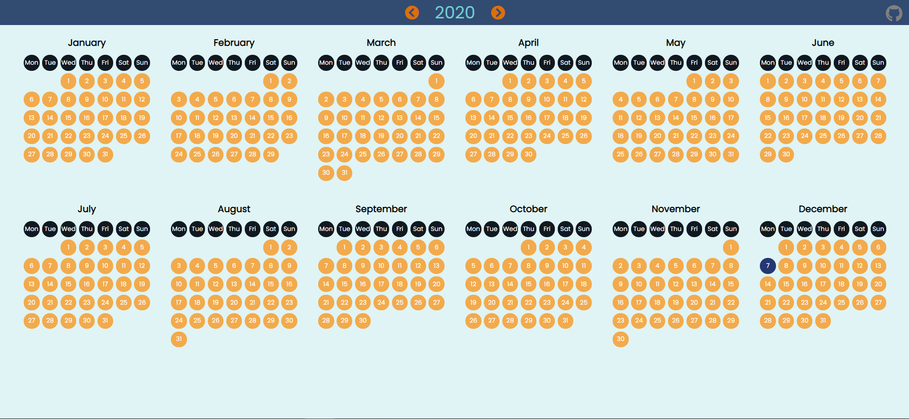
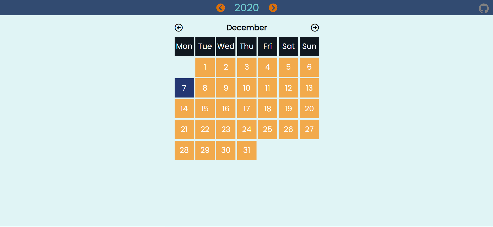

# Calendar

It's a simple calendar that shows the dates of each month for the year selected.

Year can be changed using the adjacent arrows of the year displayed.

## Year display

## Month display

By clicking the year, the calendar can be toggled to month view.

> You can see the live site/app at: https://simple-calendar-app.netlify.app/
